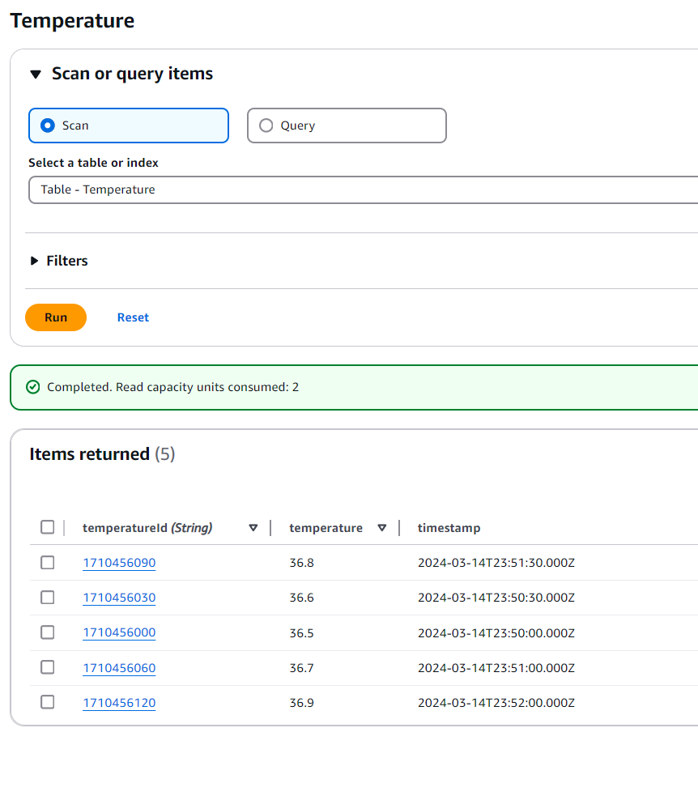
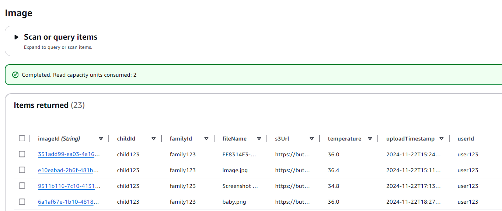
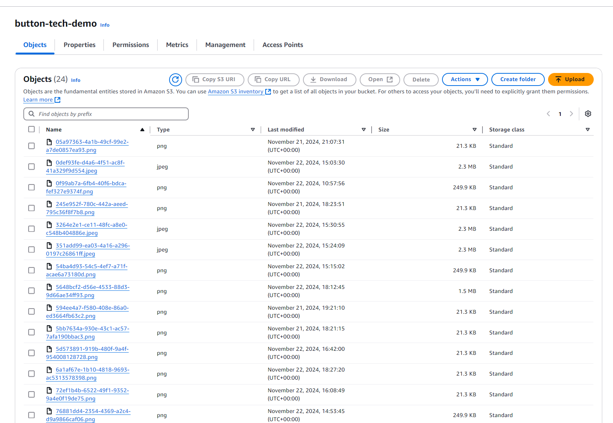

## Introduction ##


 
 
 
 


This is a Next.js project that allows you to upload images and receive a temperature reading every 5 seconds from an emulated WebSocket.

The app functions such that, on the backend, there is a file called `temperatureService.ts` together with `temperatureContext.tsx` that generates a temperature reading every 5 seconds using WebSocket with Pooling before establishing a websocket connection. The app uses the WebSocket library `socket.io` to retrieve the temperature readings and display them on the frontend in `TemperatureDisplay.tsx`. Simultaneously, images are uploaded to S3, and the metadata is saved to DynamoDB via `imageService.ts`. On the frontend, the app uses `ImageUpload.tsx` to upload images.

The app is also a Progressive Web App (PWA), which can be installed as a desktop app in Chrome or added as a mobile shortcut to your phone's home screen. A version of the app is hosted on AWS Amplify and is accessible via this link: https://main.d3p1931ccj3bzj.amplifyapp.com.  <span style="color: red">Please note that the WebSocket connection does not fully work on the hosted version when multiple users are connected simultaneously.</span> To resolve this issue, you can run the app locally. (To fix the problem permanently, I would need to set up a Lambda function with an API Gateway WebSocket connection and connect it to the frontend.)

### API Endpoints

The app uses the following API endpoints:

- **`/api/upload`**: Uploads an image to S3 and saves the metadata to DynamoDB.
- **`/api/temperatures`**: Retrieves temperature readings from DynamoDB.
- **`/api/currentTemp`**: Fetches the current temperature reading from the backend via WebSocket.

The **`/api/temperatures`** endpoint is called in `TemperatureGraph.tsx` to retrieve temperature readings and display them in a graph. Please note that the tables for this API and `/api/upload` are different. The `Temperature` table is designed to receive data from the device every few seconds, while the `Images` table only records image upload timestamps, corresponding temperature readings, and links to images stored in S3. (Refere to the images below)

### Hosting and Environment Variables

The app hosted on Amplify has environment variables passed in from the Amplify console. This allows you to upload images to my S3 bucket and save metadata to my DynamoDB table. To test this functionality on your AWS account, you will need to create a `.env.local` file in the root folder of the project and add the following:

- `REGION=<your-region>`
- `ACCESS_KEY_ID=<your-access-key-id>`
- `SECRET_ACCESS_KEY=<your-secret-access-key>`
- `S3_BUCKET_NAME=<your-s3-bucket-name>`

<span style="color: yellow">Ensure your AWS credentials have the necessary permissions to access the S3 bucket and DynamoDB table.</span>

### Testing Functionality on the Hosted App

You can test how the `/api/upload` endpoint works in the hosted Amplify application. When you upload an image, the URL of the image will appear in the alert at the top. You can follow this URL to verify that the image has been uploaded to the S3 bucket.  
<span style="color: yellow">The S3 bucket has been set to public, so you can view the image directly from the bucket.</span>

### Insights Page

On the Insights page, you can view a temperature graph generated by the `/api/temperatures` endpoint. This endpoint retrieves data from the DynamoDB table and displays the temperature readings in a graph. For testing purposes, I manually entered temperature readings into the table to verify the GET request. If I add entries to the table it will get updated once the page is reloaded

---

## Running the App Locally

To run the app locally, you will need Node.js and npm installed. Once these are set up, run the following commands in the root folder of the project:

1. `npm install`
2. `npm run dev`

Create a `.env.local` file in the root folder of the project and add the following:

- `REGION=<your-region>`
- `ACCESS_KEY_ID=<your-access-key-id>`
- `SECRET_ACCESS_KEY=<your-secret-access-key>`
- `S3_BUCKET_NAME=<your-s3-bucket-name>`


Make sure if you want to test your AWS, that you give the read and write premissions to the AIM role for the S3 bucket and DynamoDB table. Make the following tables in your DynamoDB account:

- Temperature
- Image

  You can follow the structure of the tabels as they are given in the images below

And S3 bucket with the name of your choice and change the name in the `.env.local` file. (As your s3 bucket name needs to be unique)

## Folder structure ##


```plaintext
├── public/                        # Static files directory
│   ├── manifest.json             # PWA configuration and metadata
│   ├── sw.js                     # Service Worker for offline functionality
│   └── workbox-.js              # PWA workbox utilities
│
├── src/
│   ├── components/               # React components directory
│   │   ├── common/              # Shared/reusable components
│   │   │   ├── layouts/         # Layout components
│   │   │   │   ├── Page.tsx    # Base page layout wrapper
│   │   │   │   └── Section.tsx # Section container component
│   │   │   ├── Alert.tsx       # Alert system component for notifications
│   │   │   ├── BottomNav.tsx   # Bottom navigation bar
│   │   │   └── HeaderNav.tsx   # Header navigation bar
│   │   │
│   │   ├── Home.tsx            # Main page component with temperature and upload
│   │   ├── ImageUpload.tsx     # Handles image upload with drag-and-drop
│   │   ├── Meta.tsx            # Head metadata component
│   │   ├── TemperatureDisplay.tsx  # Real-time temperature display
│   │   └── TemperatureGraph.tsx    # Temperature history visualization
│   │
│   ├── contexts/                # React Context providers
│   │   ├── AlertContext.tsx    # Alert system state management
│   │   └── TemperatureContext.tsx  # Temperature data state management
│   │
│   ├── pages/                   # Next.js pages directory
│   │   ├── api/                # API routes
│   │   │   ├── currentTemp.ts  # Current temperature endpoint
│   │   │   ├── socket.ts       # WebSocket connection handler
│   │   │   ├── temperatures.ts # Temperature history endpoint
│   │   │   └── upload.ts       # Image upload endpoint
│   │   │
│   │   ├── _app.tsx           # Next.js app wrapper with providers
│   │   ├── _document.tsx      # Custom document configuration
│   │   ├── index.tsx          # Homepage route
│   │   └── insights.tsx       # Temperature insights page
│   │
│   ├── services/               # Business logic layer
│   │   ├── imageService.ts    # Image upload and metadata handling
│   │   ├── s3Service.ts       # AWS S3 interaction service
│   │   └── temperatureService.ts  # Temperature data management
│   │
│   ├── svg/                    # SVG components
│   │   ├── BabySvg.tsx        # Baby icon component
│   │   ├── HomeSvg.tsx        # Home icon component
│   │   └── index.ts           # SVG components export
│   │
│   └── styles/                 # Styling directory
│       └── globals.css         # Global styles and Tailwind imports
│
├── .eslintrc.json              # ESLint configuration
├── .gitignore                  # Git ignore patterns
├── next.config.js              # Next.js configuration
├── package.json                # Project dependencies and scripts
├── postcss.config.js           # PostCSS configuration for Tailwind
├── tailwind.config.js          # Tailwind CSS configuration
├── tsconfig.json               # TypeScript configuration
└── tsconfig.node.json          # Node-specific TypeScript config

```
## Images ##
database snipet from DynamoDB of Temperature table used by ```/api/temperatures``` endpoint: 

Example of image uploaded to S3 by ```/api/upload``` endpoint: <span style="color: yellow">Please not that the Image table has extra columns as it would have in real case so you can map it to a family, user or child. This is not used currentrly for this app the child id, user id and famliy id are hardcoded. (need to add child name as well)</span>


Example of S3 bucket with the image uploaded:


## Acknowledgements and resources ##

- PWA template was taken from this template: https://github.com/AjayKanniyappan/nextjs-pwa-template
- Alerts tailwind was taken from : https://flowbite.com/docs/components/alerts/
- Baby svg was taken from : https://imgbin.com/png/FfXbv3nU/computer-icons-child-infant-png
- Documentation for socket.io was taken from: https://socket.io/docs/v4/
- Coding AI models used Cursor, v0-Next.js, ChatGPT 

## Versions and Dependencies

### Core Dependencies
- Node.js: v18.x or higher
- Next.js: 13.1.2
- React: 18.2.0
- TypeScript: 4.9.4

### AWS SDK
- @aws-sdk/client-dynamodb: ^3.696.0
- @aws-sdk/client-s3: ^3.697.0
- @aws-sdk/s3-request-presigner: ^3.697.0

### UI and Styling
- Tailwind CSS: ^3.4.15
- Framer Motion: ^11.11.17
- Highcharts: ^11.4.8 (redundant)
- Recharts: ^2.13.3

### Data Fetching & Real-time
- Axios: ^1.7.7
- Socket.io: ^4.8.1
- Socket.io-client: ^4.8.1

### PWA Support
- next-pwa: ^5.6.0

### Development Tools
- ESLint: ^8.56.0
- PostCSS: ^8.4.49
- Autoprefixer: ^10.4.20

### Type Definitions
- @types/react: 18.0.26
- @types/react-dom: 18.0.10
- @types/node: 18.11.18
